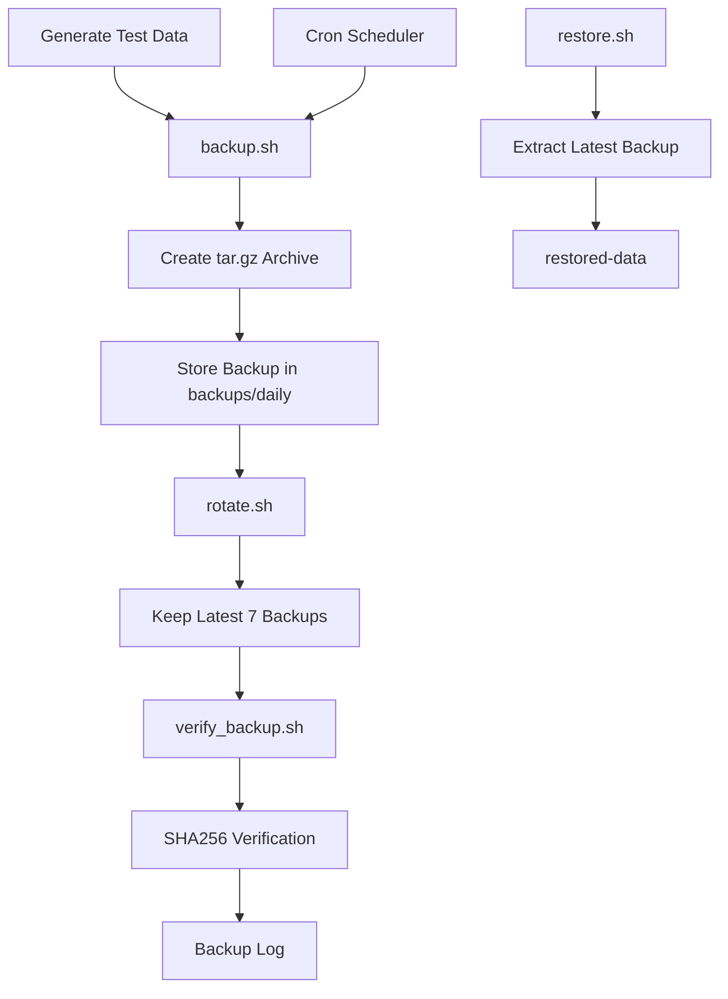

# Linux Backup & Disaster Recovery Automation

A production-inspired Linux Backup & Disaster Recovery automation project built using Bash scripting. The project automates backup creation, backup verification, backup rotation, and data restoration while following Linux administration best practices.

---

## Features

- Automated backup creation using Bash
- Compressed backups using tar.gz
- Backup verification after every backup
- Automatic backup rotation based on retention policy
- Restore backups with a single command
- Centralized configuration using `config.sh`
- Shared utility functions using `functions.sh`
- Logging of backup and restore operations
- Cron-based automated scheduling
- Modular project structure

---

## Technologies Used

- Linux (Ubuntu/WSL)
- Bash Scripting
- Cron
- tar
- SHA256 Checksum
- Git & GitHub
- Docker (Project Ready)

---

## Project Architecture


## Project Structure

```text
linux-backup-disaster-recovery/
├── backups/
│   ├── daily/
│   ├── weekly/
│   └── monthly/
├── docker/
├── logs/
├── restored-data/
├── screenshots/
├── scripts/
│   ├── backup.sh
│   ├── restore.sh
│   ├── rotate.sh
│   ├── verify_backup.sh
│   ├── scheduler.sh
│   └── generate_test_data.sh
├── test-data/
├── config.sh
├── functions.sh
├── README.md
└── .gitignore
```

---

## Workflow

1. Generate sample data.
2. Create compressed backup.
3. Verify backup integrity.
4. Rotate old backups.
5. Restore backup when required.
6. Automate execution using Cron.

---

## Manual Backup

```bash
./scripts/backup.sh
```

---

## Restore Backup

```bash
./scripts/restore.sh
```

---

## Verify Backup

```bash
./scripts/verify_backup.sh
```

---

## Backup Rotation

```bash
./scripts/rotate.sh
```

---

## Generate Sample Data

```bash
./scripts/generate_test_data.sh
```

---

## Cron Automation

Example:

```cron
*/2 * * * * /bin/bash /home/jana/linux-backup-disaster-recovery/scripts/backup.sh
```

> For demonstration purposes the backup runs every 2 minutes. In a production environment, backups would typically run once per day or according to organizational requirements.

---

## Learning Outcomes

- Bash scripting
- Linux administration
- Backup automation
- Disaster recovery
- Cron scheduling
- Log management
- Backup verification
- Backup retention strategies
- Git & GitHub workflow

---
## 📸 Screenshots

### Backup Creation


---

### Backup Files


---

### Backup Verification


---

### Restore Process


---

### Cron Automation


## Future Improvements

- Email notifications
- Remote backup using rsync
- Cloud backup support
- Backup encryption
- Docker volume backup
- HTML reporting

---

## Author

**Jana Sri**

Aspiring Linux Administrator | Cloud & DevOps Enthusiast
