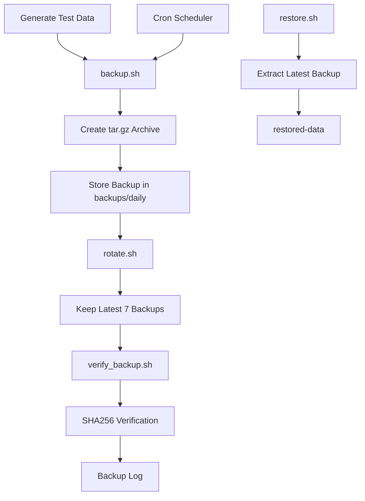
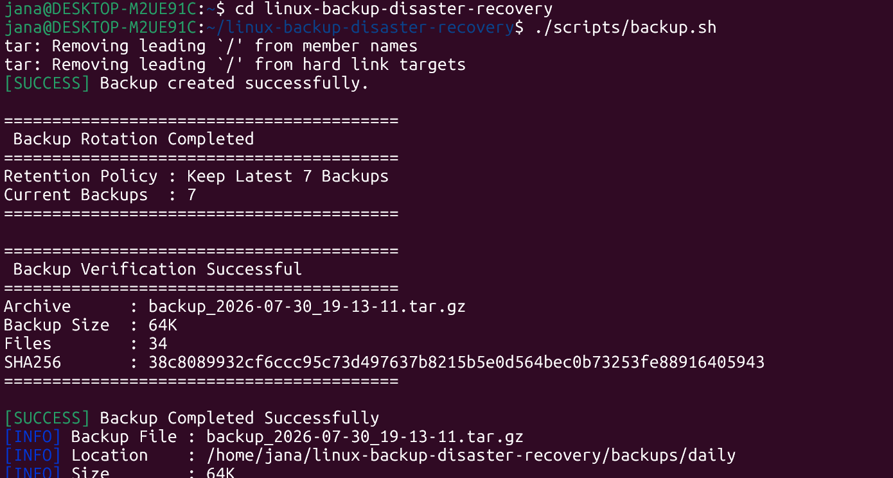
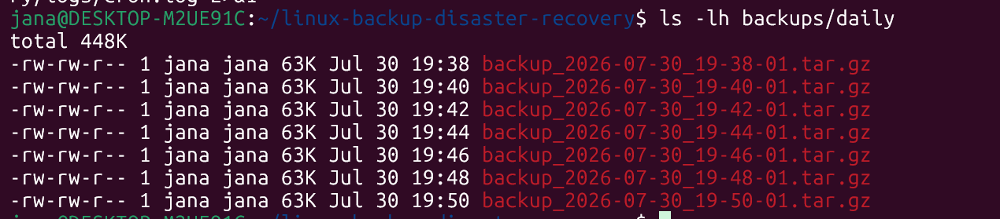
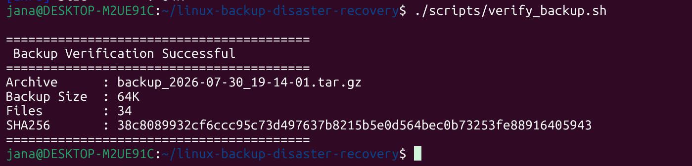
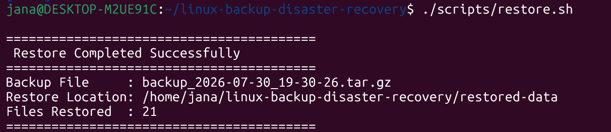
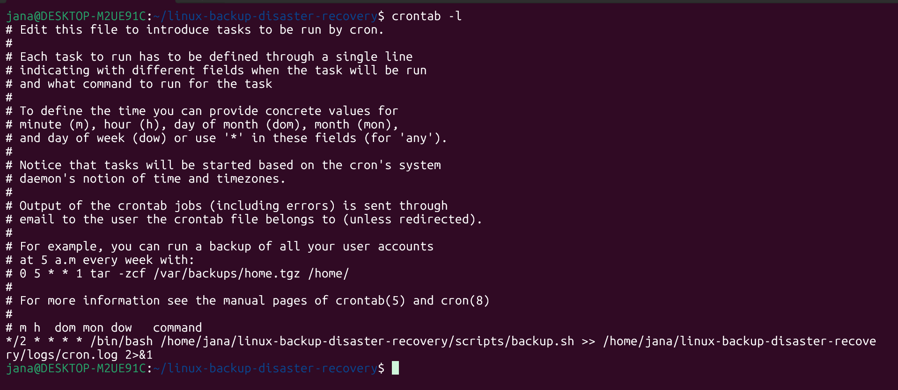
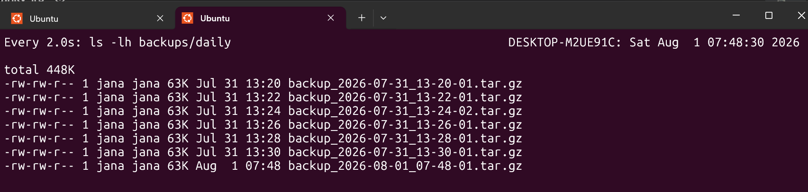

#  Linux Backup & Disaster Recovery Automation


A production-inspired **Linux Backup & Disaster Recovery Automation Framework** built entirely with **Bash scripting**. This project automates backup creation, backup verification, backup rotation, data restoration, and scheduled execution using **Cron**, following Linux administration best practices.

---

# ✨ Features

- Automated backup creation using Bash
- Compressed backups using tar.gz
- Backup verification after every backup
- Automatic backup rotation based on retention policy
- Restore backups with a single command
- Centralized configuration using `config.sh`
- Shared utility functions using `functions.sh`
- Logging of backup and restore operations
- Cron-based automated scheduling
- Modular project structure
- Production-inspired Linux Administration project

---

# 🛠 Technologies Used

- Linux (Ubuntu / WSL)
- Bash Scripting
- Cron
- tar
- SHA256 Checksum
- Git
- GitHub
- Docker (Project Ready)

---

# 🏗 Project Architecture



---

# 📂 Project Structure

```text
linux-backup-disaster-recovery/
├── backups/
│   ├── daily/
│   ├── weekly/
│   └── monthly/
├── docker/
├── logs/
├── restored-data/
├── screenshots/
├── scripts/
│   ├── backup.sh
│   ├── restore.sh
│   ├── rotate.sh
│   ├── verify_backup.sh
│   ├── scheduler.sh
│   └── generate_test_data.sh
├── test-data/
├── config.sh
├── functions.sh
├── README.md
└── .gitignore
```

---

# 🔄 Workflow

1. Generate sample data.
2. Create compressed backup.
3. Verify backup integrity.
4. Rotate old backups.
5. Restore backup when required.
6. Automate backup execution using Cron.

---

# 📥 Installation

Clone the repository

```bash
git clone https://github.com/<YOUR_USERNAME>/linux-backup-disaster-recovery.git
```

Move into the project

```bash
cd linux-backup-disaster-recovery
```

Give execute permission to all scripts

```bash
chmod +x scripts/*.sh
chmod +x functions.sh
```

---

# 🚀 Quick Start

Generate sample data

```bash
./scripts/generate_test_data.sh
```

Create backup

```bash
./scripts/backup.sh
```

Verify backup

```bash
./scripts/verify_backup.sh
```

Restore backup

```bash
./scripts/restore.sh
```

---

# ▶️ Manual Execution

## 1️⃣ Generate Test Data

```bash
./scripts/generate_test_data.sh
```

This script creates sample directories and files that simulate user data for backup testing.

---

## 2️⃣ Create Backup

```bash
./scripts/backup.sh
```

### Expected Output

```
Backup Completed Successfully

Backup File :
backup_2026-07-30_18-12-01.tar.gz

Location :
backups/daily/

Size :
64 KB
```

---

## 3️⃣ Verify Backup

```bash
./scripts/verify_backup.sh
```

### Expected Output

```
Backup Verification Successful

Archive Verified
SHA256 Generated
Backup Integrity Verified
```

---

## 4️⃣ Restore Backup

```bash
./scripts/restore.sh
```

### Expected Output

```
Restore Completed Successfully

Latest Backup Restored

Files Restored Successfully
```

---

## 5️⃣ Backup Rotation

```bash
./scripts/rotate.sh
```

### Expected Output

```
Retention Policy : Keep Latest 7 Backups

Backup Rotation Completed
```

---

# ⏰ Cron Automation

This project supports automatic backup scheduling using **Cron**.

For demonstration purposes, the backup is scheduled to execute every **2 minutes**.

---

## Step 1 — Open Cron Editor

```bash
crontab -e
```

---

## Step 2 — Add the Cron Job

```cron
*/2 * * * * /bin/bash /home/jana/linux-backup-disaster-recovery/scripts/backup.sh >> /home/jana/linux-backup-disaster-recovery/logs/cron.log 2>&1
```

Save and exit.

---

## Step 3 — Verify the Cron Job

```bash
crontab -l
```

Expected Output

```cron
*/2 * * * * /bin/bash /home/jana/linux-backup-disaster-recovery/scripts/backup.sh >> /home/jana/linux-backup-disaster-recovery/logs/cron.log 2>&1
```

---

## Step 4 — Start the Cron Service

```bash
sudo service cron start
```

Check its status

```bash
sudo service cron status
```

Expected Output

```
cron is running
```

---

# 📊 Monitoring Cron Automation

Once Cron is configured, **do not run `backup.sh` manually**.

Cron will execute it automatically every **2 minutes**.

## View Cron Output

```bash
tail -f logs/cron.log
```

---

## View Backup Log

```bash
tail -f logs/backup.log
```

---

## Watch Backup Files

```bash
watch -n 2 "ls -lh backups/daily"
```

A new backup archive will automatically appear every **2 minutes**.

---

# 🎥 Demonstrating Automation

Open **three terminals**.

### Terminal 1

Monitor Cron output

```bash
tail -f logs/cron.log
```

---

### Terminal 2

Watch newly created backup files

```bash
watch -n 2 "ls -lh backups/daily"
```

---

### Terminal 3

Display the configured Cron schedule

```bash
crontab -l
```

Wait approximately **2 minutes**.

You will observe:

- ✅ A new backup archive being created automatically.
- ✅ Cron log updating after execution.
- ✅ Backup directory showing the latest backup.
- ✅ No manual execution of `backup.sh` is required.

---

# 📸 Screenshots

## Backup Creation



---

## Backup Files



---

## Backup Verification



---

## Restore Process



---

## Cron Automation



---

## Backups Daily Output

.

---

# 📚 Learning Outcomes

- Linux Administration
- Bash Scripting
- Backup Automation
- Disaster Recovery
- Cron Scheduling
- File Compression using tar
- SHA256 Checksum Verification
- Backup Rotation
- Log Management
- Modular Shell Scripting
- Git & GitHub Workflow
- Production-style Linux Project Development

---

# 🚀 Future Improvements

- Email notifications after backup completion
- Remote backup using rsync
- Backup encryption
- Cloud backup support (AWS S3)
- Docker volume backup
- HTML report generation
- Backup status dashboard

---

